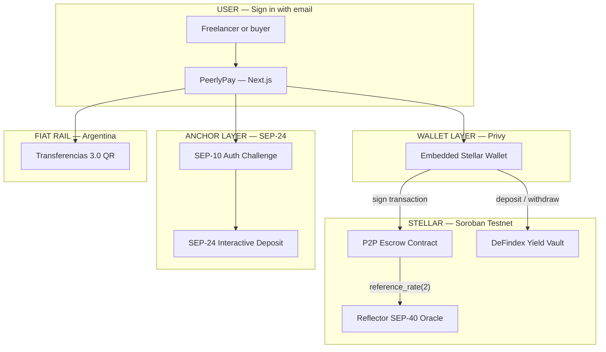
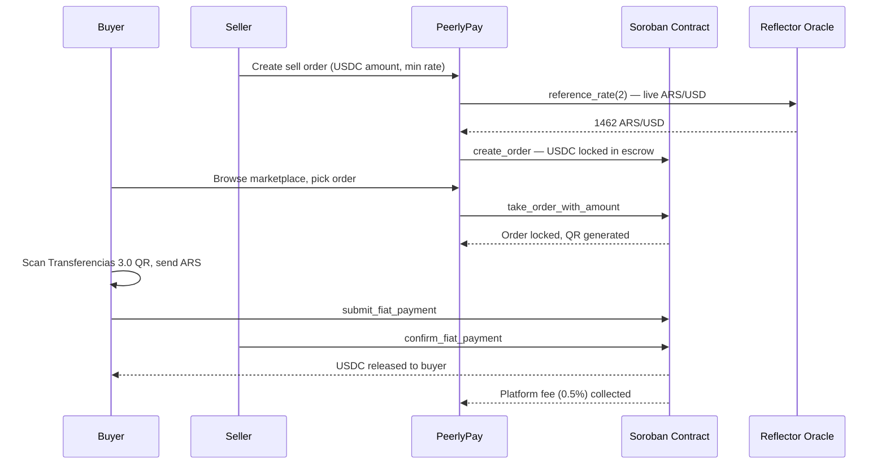
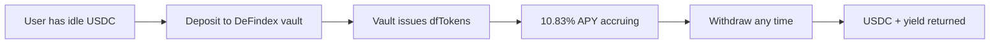
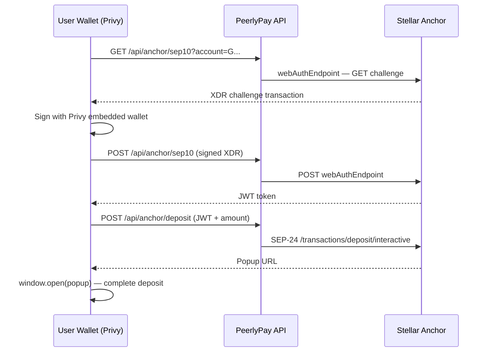

# PeerlyPay — Earn Global, Spend Local

> *From dollar to peso in seconds. No bank. No middleman. Just code.*

## One-liner

**Send dollars, receive pesos — the contract holds the money until both sides confirm. No middleman, no custody, no frozen funds.**

---

# 💡 The Problem

Argentina runs on two currencies.

People **earn and save in dollars** — but **spend in pesos**, every day.

Under persistent inflation and capital controls, converting between them means:
- KYC-heavy centralized exchanges
- Custodial wallets controlled by companies
- Opaque spreads and slow settlement
- Trust in a middleman who can freeze your funds

Stablecoins already make up **over 50% of all ARS exchange purchases** ([Chainalysis, 2025](https://www.chainalysis.com/blog/latin-america-crypto-adoption-2025/)).
Argentina is **#2 in Latin America** by crypto volume.

The demand is there. The rails weren't.

👉 Until now.

---

# ⚙️ How it works

## 1. Sign in — no seed phrase needed

- Open PeerlyPay and sign in with your email
- A Stellar smart wallet is created automatically (powered by Privy)
- No "wallet" jargon, no seed phrase, no extensions

👉 A regular person can use this in 30 seconds

---

## 2. Browse orders — live rate from the blockchain

- The marketplace shows open orders: people selling USDC for ARS, or buying it
- The exchange rate is read **directly from a Soroban contract** that calls the **Reflector SEP-40 oracle**
- The price isn't set by us — it's pulled on-chain, verifiable by anyone

```jsonc
// GET /api/rates (live)
{ "usdArs": 1462, "source": "contract", "contract": 1462, "reflector": 1461.92 }
```

👉 No operator can manipulate the rate

---

## 3. Trade — USDC goes into escrow, never a company wallet

When you take an order:

1. **USDC is locked** in the Soroban escrow contract — not held by PeerlyPay
2. The buyer sends ARS off-chain via **Transferencias 3.0 QR** (Argentina's instant payment rail)
3. The seller confirms receipt → **contract releases USDC** to the buyer
4. If there's a dispute → an on-chain `dispute_resolver` settles it

The contract is the only entity that ever holds funds during a trade.

👉 Self-custodial from start to finish

---

## 4. Earn — idle USDC works for you

Between trades, USDC sitting in your wallet earns **10.83% APY** automatically *(live on Stellar testnet)*.

- Powered by **DeFindex yield vaults** on Stellar
- Deposit and withdraw any time — no lock-up period
- No action needed: just hold USDC and it grows

👉 Your savings work while you sleep

---

## 5. Add funds — via any bank anchor

- The `/anchor` page lets you deposit USDC from any SEP-24 compatible anchor
- Full **SEP-10 + SEP-24** interactive flow: wallet signs a challenge → gets a JWT → anchor popup opens
- Works with any Stellar anchor, not just one provider

👉 Open, interoperable, not locked to one bank

---

# 🎯 Key Innovations

### 🔗 On-chain rate, mediated by our own contract

Most P2P ramps quote a rate from a backend the operator controls.

PeerlyPay reads it **on-chain**:

- Contract calls `reference_rate(2)` (`2` = ARS in the Reflector asset schema) → **cross-contract call into Reflector** → returns live ARS/USD
- Frontend reads through the contract first, with fallback to Reflector, then BCRA official rate
- The BCRA spread is shown next to the market rate — full transparency

---

### 🔒 Soroban escrow — the trust anchor

The smart contract is the only custodian during a trade:

- `create_order` → USDC locked
- `take_order_with_amount` → partial fills supported
- `submit_fiat_payment` → buyer proves off-chain payment
- `confirm_fiat_payment` → USDC released
- `dispute_fiat_payment` + `resolve_dispute` → on-chain arbitration
- `execute_fiat_transfer_timeout` → automatic refund if counterparty ghosts

---

### 💸 DeFindex yield vault

Idle USDC earns passively while users aren't trading:

- Deposit → DeFindex SDK builds and signs a Soroban transaction
- Vault issues dfTokens representing the user's share
- Withdraw any time — no minimum, no lock-up
- Live APY: **10.83%**

---

### 📱 No crypto jargon

The app speaks plain language:
- No "wallet" buttons — just "Sign in"
- No "USDC trustline" — just "Add USDC"
- No "Stellar testnet" indicator — just "Active"
- No "liquidity provider" — just "Become a seller"

---

# 🏗️ Architecture

## System Overview



---

## Trade Flow



---

## DeFindex Earn Flow



---

## SEP-10 + SEP-24 Anchor Flow



---

## Tech Stack

| Layer | Technology | Why |
|---|---|---|
| **Frontend** | Next.js 16 + React 19 | App Router, server routes for API proxies |
| **Styling** | Tailwind v4 + shadcn/ui | Mobile-first, fast iteration |
| **Wallet** | Privy embedded Stellar wallets | Email login, no seed phrase, real Stellar signing |
| **Escrow** | Soroban P2P contract (Rust) | Trustless, self-custodial, on-chain state machine |
| **Rate oracle** | Reflector SEP-40 (cross-contract call) | Live ARS/USD rate, not operator-controlled |
| **Yield vault** | DeFindex SDK | 10.83% APY on idle USDC, no lock-up |
| **Anchor** | SEP-10 + SEP-24 (full interactive) | Interoperable deposit/withdraw via any Stellar anchor |
| **Fiat rail** | Transferencias 3.0 QR (EMVCo / CRC16) | Argentina's BCRA instant payment rail |
| **Deployment** | Vercel | SSR + edge API routes |

---

## Contract Entrypoints

`initialize` · `pause` / `unpause` · `create_order` / `create_order_cli` · `cancel_order` · `take_order` / `take_order_with_amount` · `submit_fiat_payment` · `execute_fiat_transfer_timeout` · `confirm_fiat_payment` · `dispute_fiat_payment` · `resolve_dispute` · `get_order` / `get_order_count` · `get_config` · `set_oracle` / `get_oracle` · `reference_rate`

---

# 🚀 For Judges — Start Here

**🌐 Live app:** https://peerlypay-main.vercel.app

**Try it in 2 minutes:**

1. **No wallet needed.** Open the app → **Marketplace** → click any of the 3 live seed orders → walk the full flow: **Confirm** (live oracle rate) → **Payment** (Transferencias 3.0 QR) → **Waiting** → **Success**

2. **With a real wallet.** Click Sign in → enter your email → Privy creates a Stellar wallet automatically → take a real on-chain order

**Verify the Stellar integrations directly:**

| What | Where |
|---|---|
| Live ARS/USD from our contract → Reflector oracle | `GET /api/rates` → `{"source":"contract", "usdArs":1462}` |
| P2P escrow contract (testnet, 3 live orders) | [stellar.expert/explorer/testnet/contract/CAEHRNAP…](https://stellar.expert/explorer/testnet/contract/CAEHRNAPSRSFYGG7BRTZY3XX2XEYSCOJUHIJUYO2FYRJATYUXDFA5JQD) |
| Live SEP-24 anchor capabilities | `GET /api/anchor/info` · in-app at `/anchor` |
| DeFindex live APY | `GET /api/defindex/apy` → `{"apy":{"apy":10.83}}` |
| Contract test suite | `cargo test -p p2p` → **20/20 passing** |

---

## 🔗 SCF Integration Track

PeerlyPay integrates three building blocks from the [official SCF Integration List](https://stellar.gitbook.io/scf-handbook/scf-awards/build-award/integration-track/integration-list):

| Integration | Category | How it's used |
|---|---|---|
| **Privy** | Wallet Integration | Embedded Stellar wallets — email login, no seed phrase, real Soroban signing |
| **SEP-24 Anchor Platform** | On/Off-Ramping | Full SEP-10 + SEP-24 interactive deposit/withdraw flow with any compliant anchor |
| **DeFindex** | DeFi — Yield Aggregators | Idle USDC earns 10.83% APY in a vault while users aren't trading *(testnet)* |

---

## 🎯 PULSO Judging Criteria

| Criterion | Evidence |
|---|---|
| **Integration depth & technical complexity** | Soroban escrow + **cross-contract call** to Reflector SEP-40 for on-chain rate; Privy embedded wallets; full SEP-10 + SEP-24; DeFindex yield vault; Transferencias 3.0 QR. 20/20 contract tests. |
| **Impact on the Stellar ecosystem** | Non-custodial USDC↔ARS ramp for a market where stablecoins are >50% of ARS exchange purchases. Uses four Stellar building blocks: Soroban, Reflector, SEP-24, DeFindex. |

| **Customer discovery & validation** | Interview guide + findings: [docs/hackathon/CUSTOMER_DISCOVERY.md](docs/hackathon/CUSTOMER_DISCOVERY.md) |
| **Quality of testnet deployment** | Live contract `CAEHRNAP…5JQD`, 3 seed orders, verified on `stellar.expert`. Live `/api/rates` reading through the contract. Platform fee 0.5% active. |

---

# ❓ Q&A (Judge Defense)

---

## ❓ "Why not just use a CEX to convert USDC to pesos?"

> **"A CEX requires KYC, holds your funds, charges hidden spreads, and can freeze your account. PeerlyPay puts the USDC in a contract — nobody can freeze it except the trade completing. Peer-to-peer means the spread goes to the counterparty, not a company."**

---

## ❓ "The rate could be wrong or stale"

> **"The rate is a cross-contract call from our Soroban contract into the Reflector SEP-40 fiat oracle — the same oracle used across the Stellar ecosystem. We don't set it. We read it. It's verifiable on-chain by anyone."**

---

## ❓ "What if a buyer pays ARS but the seller refuses to release USDC?"

> **"The seller's USDC is locked in the escrow contract before the buyer does anything. If the seller doesn't confirm within a timeout window, `execute_fiat_transfer_timeout` releases it automatically. On a dispute, the `dispute_resolver` address settles it on-chain (initially set to the team admin; intended to move to a multisig before mainnet)."**

---

## ❓ "DeFindex — is the 10.83% APY real or mocked?"

> **"It's live. Hit `GET /api/defindex/apy` on the running app — it calls the DeFindex SDK against their testnet vault in real time and returns the actual current APY."**

---

## ❓ "Why Privy instead of asking users to install a wallet?"

> **"Our target users are Argentine freelancers, not crypto developers. Email login creates a Stellar wallet behind the scenes. They never see a seed phrase. Privy signs every Soroban transaction with their embedded wallet — the user just approves."**

---

## ❓ "Is this just a frontend demo or does it do real on-chain things?"

> **"Every order in the marketplace is a real Soroban contract state. The live contract has 3 seeded orders. The oracle rate is a live cross-contract call. DeFindex balance is a live vault query. SEP-10/24 talks to a real anchor. The escrow writes are real Stellar transactions."**

---

# 🔥 Closing Line

> **"PeerlyPay is the non-custodial on-ramp Argentina's freelancers were missing — every peso conversion backed by a Soroban escrow, every rate pulled from the chain, and idle dollars earning yield while people aren't trading."**

---

## Run it locally

```bash
cp .env.example .env.local   # fill in your keys
npm install
npm run dev                  # http://localhost:3000
```

| Variable | Value |
|---|---|
| `NEXT_PUBLIC_PRIVY_APP_ID` | your Privy app ID |
| `NEXT_PUBLIC_P2P_CONTRACT_ID` | `CAEHRNAPSRSFYGG7BRTZY3XX2XEYSCOJUHIJUYO2FYRJATYUXDFA5JQD` |
| `NEXT_PUBLIC_SOROBAN_RPC_URL` | `https://soroban-testnet.stellar.org` |
| `NEXT_PUBLIC_STELLAR_NETWORK_PASSPHRASE` | `Test SDF Network ; September 2015` |
| `NEXT_PUBLIC_REFLECTOR_FIAT_ORACLE_ID` | `CCSSOHTBL3LEWUCBBEB5NJFC2OKFRC74OWEIJIZLRJBGAAU4VMU5NV4W` |

---

## Contract (build via WSL/Linux)

```bash
cargo test -p p2p                                   # 20/20 passing
cargo build -p p2p --target wasm32v1-none --release
```

---

*Built for the Stellar PULSO Argentina hackathon. · MIT License.*
