# PeerlyPay — Architecture

**A non-custodial P2P marketplace where Argentine freelancers swap USDC for pesos — backed by a Soroban escrow, a live on-chain oracle, and a yield vault that puts idle dollars to work.**

This document describes the PeerlyPay application architecture: what it does, which Stellar tools it uses, how the contracts and the off-chain layer fit together, and the flows that connect them. Diagrams use [Mermaid](https://mermaid.js.org/) and render on GitHub.

---

## 1. High-level system overview

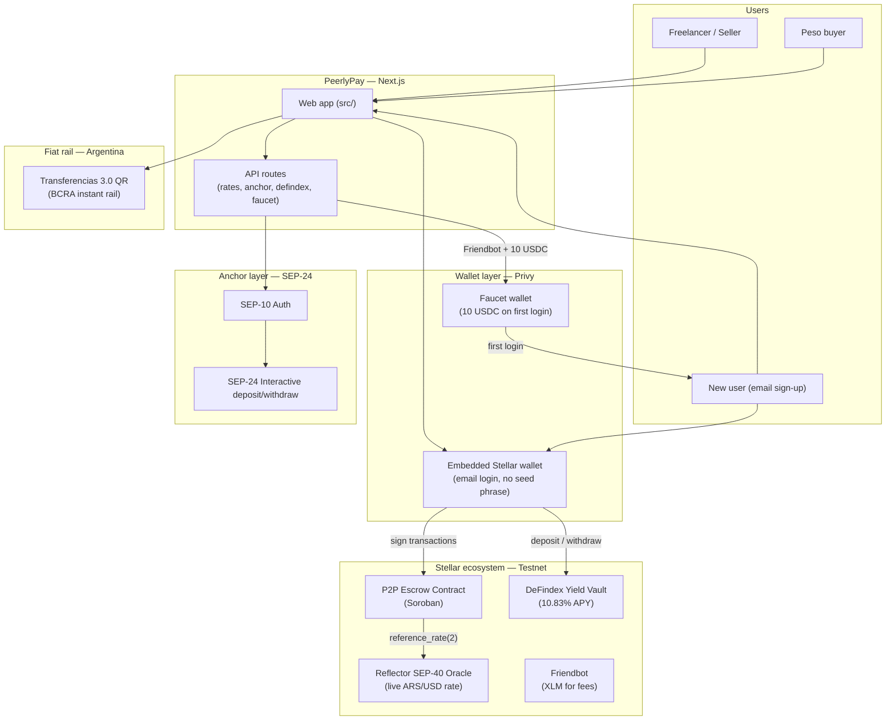

PeerlyPay is a mobile-first web app where freelancers and peso buyers trade USDC↔ARS directly, peer-to-peer. A single Soroban contract holds the on-chain logic: escrow, release, dispute, and timeout. The exchange rate is read on-chain via a cross-contract call to the Reflector SEP-40 oracle — not set by the operator. Idle USDC earns 10.83% APY in a DeFindex vault. New users get 10 USDC automatically on first login so they can trade immediately.

---

## 2. What the application does

### 2.1 User roles

| Role | Main actions |
|---|---|
| **Freelancer / Seller** | Sign in with email, post a sell order (USDC → ARS), receive ARS off-chain, confirm payment, get released. |
| **Peso buyer** | Browse marketplace, take an order, scan Transferencias 3.0 QR, send ARS, wait for USDC release. |
| **New user** | Sign in with email → Privy creates a Stellar wallet → Friendbot funds it with XLM → faucet sends 10 USDC automatically. |
| **Yield earner** | Deposit idle USDC into DeFindex vault, earn 10.83% APY, withdraw any time. |

### 2.2 Sell flow (USDC → ARS)

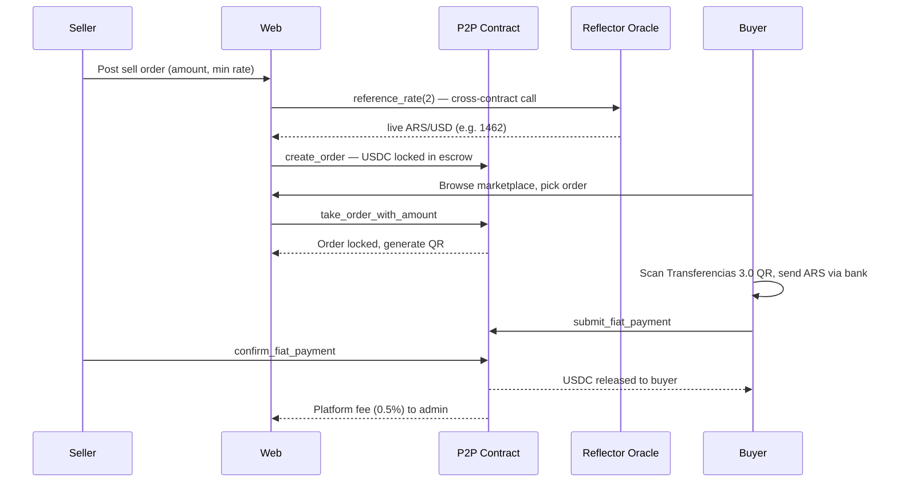

### 2.3 Buy flow (ARS → USDC)

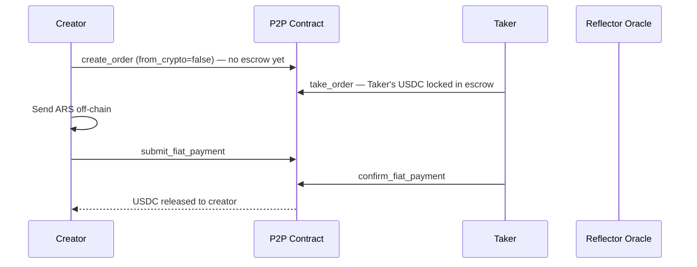

### 2.4 Dispute and timeout

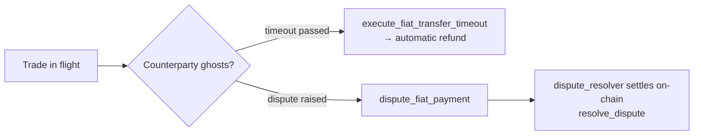

### 2.5 DeFindex earn flow

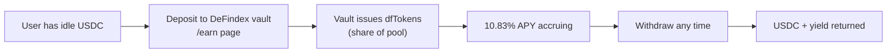

### 2.6 SEP-10 + SEP-24 anchor flow

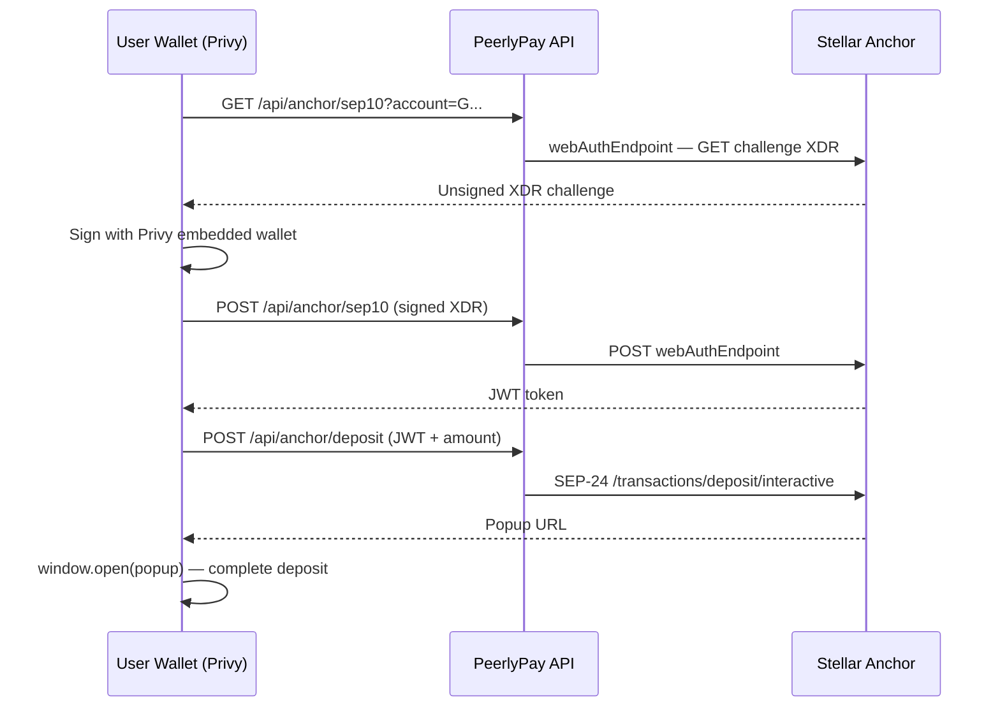

### 2.7 New user faucet flow

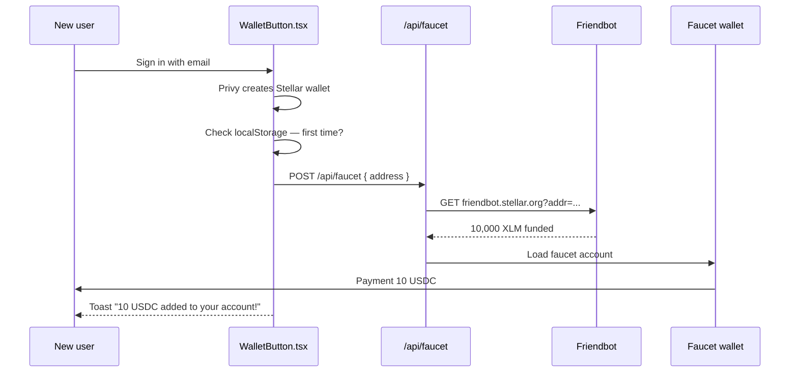

### 2.8 Application routes

| Route | Description |
|---|---|
| `/` | Landing / home |
| `/marketplace` | Browse open orders (live from contract + demo fallback) |
| `/orders/[id]` | Order detail — real chain data |
| `/trade/confirm` | Live oracle rate, take order |
| `/trade/payment` | Transferencias 3.0 QR + submit payment |
| `/trade/waiting` | Polling for confirmation |
| `/trade/success` | USDC released |
| `/anchor` | SEP-24 anchor discovery + deposit/withdraw |
| `/earn` | DeFindex yield vault — deposit, withdraw, APY |
| `/profile` | User profile, trust score, settings |
| `/wallet/bridge` | Move funds from another app |
| `/api/rates` | Live ARS/USD via contract → Reflector → BCRA |
| `/api/anchor/sep10` | SEP-10 auth proxy (CORS) |
| `/api/anchor/deposit` | SEP-24 deposit proxy |
| `/api/anchor/withdraw` | SEP-24 withdraw proxy |
| `/api/defindex/apy` | Live DeFindex APY |
| `/api/defindex/balance` | User DeFindex vault balance |
| `/api/defindex/deposit` | Build deposit XDR |
| `/api/defindex/withdraw` | Build withdraw XDR |
| `/api/faucet` | Send 10 USDC to new users |

---

## 3. Tech stack

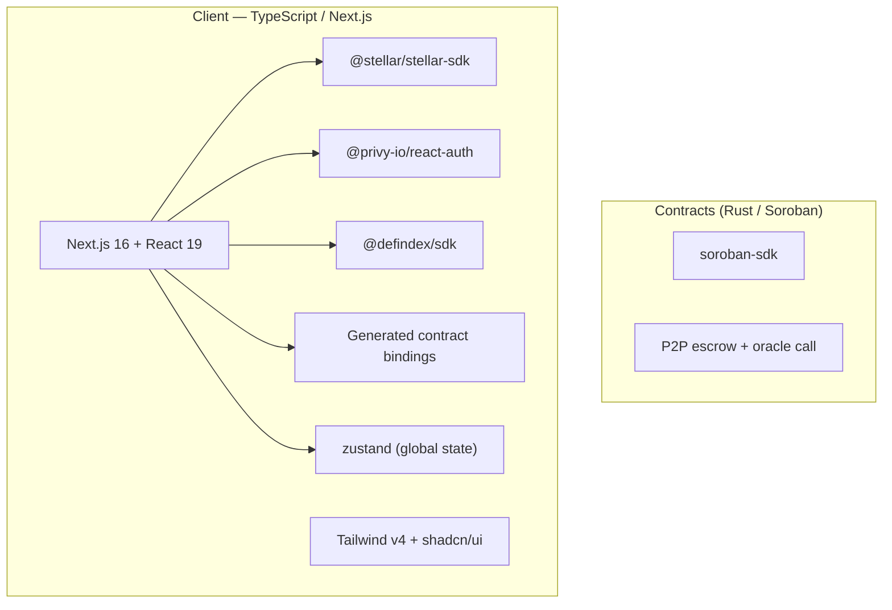

| Layer | Technology | Notes |
|---|---|---|
| **Contract** | Rust + `soroban-sdk` | P2P escrow with Reflector oracle cross-contract call |
| **Web** | Next.js 16 + React 19 + Tailwind v4 | App Router, mobile-first |
| **Wallet** | Privy embedded Stellar wallets | Email login, no seed phrase, real Soroban signing |
| **Rate oracle** | Reflector SEP-40 (cross-contract) | Live ARS/USD, not operator-controlled |
| **Yield** | DeFindex SDK | 10.83% APY vault on testnet |
| **Anchor** | SEP-10 + SEP-24 (full interactive) | Proxied through Next.js API routes to avoid CORS |
| **Fiat rail** | Transferencias 3.0 QR (EMVCo / CRC16) | BCRA instant rail for ARS leg |
| **State** | Zustand | Wallet, balance, demo orders fallback |
| **Deployment** | Vercel | SSR + edge API routes |

---

## 4. Project structure

```
peerlypay/
├── src/
│   ├── app/
│   │   ├── api/
│   │   │   ├── rates/route.ts          # GET — contract → Reflector → BCRA → fallback
│   │   │   ├── anchor/
│   │   │   │   ├── info/route.ts       # SEP-1 TOML + SEP-24 /info
│   │   │   │   ├── sep10/route.ts      # SEP-10 auth proxy (GET challenge, POST signed)
│   │   │   │   ├── deposit/route.ts    # SEP-24 deposit proxy
│   │   │   │   └── withdraw/route.ts   # SEP-24 withdraw proxy
│   │   │   ├── defindex/
│   │   │   │   ├── apy/route.ts        # Live APY from DeFindex SDK
│   │   │   │   ├── balance/route.ts    # User vault balance (dfTokens + USDC value)
│   │   │   │   ├── deposit/route.ts    # Build deposit XDR
│   │   │   │   └── withdraw/route.ts   # Build withdraw XDR
│   │   │   └── faucet/route.ts         # POST — Friendbot + 10 USDC to new users
│   │   ├── marketplace/                # Browse open orders
│   │   ├── orders/[id]/                # Order detail (real chain data)
│   │   ├── trade/
│   │   │   ├── confirm/                # Oracle rate + take order
│   │   │   ├── payment/                # Transferencias 3.0 QR
│   │   │   ├── waiting/                # Poll for confirmation
│   │   │   └── success/                # Released
│   │   ├── anchor/                     # SEP-24 anchor page
│   │   ├── earn/                       # DeFindex vault page
│   │   ├── profile/                    # User profile
│   │   ├── wallet/bridge/              # Move funds
│   │   ├── privy-provider.tsx          # Client-only PrivyProvider (ssr:false)
│   │   └── providers.tsx               # App-level providers
│   ├── components/
│   │   ├── trade/
│   │   │   └── Transferencias30QR.tsx  # EMVCo QR (CRC16) for ARS leg
│   │   ├── AnchorCard.tsx              # SEP-10 + SEP-24 interactive flow
│   │   ├── EarnCard.tsx                # DeFindex deposit/withdraw/APY UI
│   │   ├── OrderCard.tsx               # Marketplace order card
│   │   └── WalletButton.tsx            # Sign in / account dropdown + faucet trigger
│   ├── lib/
│   │   ├── contract-config.ts          # Single source of truth for contract ID
│   │   ├── p2p.ts                      # Read path: get_order, reference_rate
│   │   ├── p2p-crossmint.ts            # Write path: take/submit/confirm/create
│   │   ├── privy-wallet.ts             # useStellarWallet hook (Privy)
│   │   ├── sep24.ts                    # SEP-10 + SEP-24 helpers
│   │   ├── defindex.ts                 # DeFindex client helpers
│   │   ├── rates.ts / rates-server.ts  # Live rate (oracle + BCRA)
│   │   └── store.ts                    # Zustand store + demo orders fallback
│   └── contexts/
│       └── UserContext.tsx             # User session (localStorage)
│
├── contracts/contracts/p2p/src/
│   ├── contract.rs / lib.rs            # Entrypoints + wiring
│   ├── core/order.rs                   # Order lifecycle state machine
│   ├── core/oracle.rs                  # Reflector SEP-40 cross-contract call
│   ├── core/dispute.rs                 # Dispute resolution
│   ├── core/admin.rs                   # Admin / pause
│   └── tests/test.rs                   # 20/20 passing
│
└── docs/
    ├── architecture.md                 # This file
    └── hackathon/
        ├── SUBMISSION_CHECKLIST.md
        ├── CONTEXT.md
        └── DEMO_SCRIPT.md
```

---

## 5. The P2P escrow contract

The contract is the only entity that ever holds USDC during a trade. No company wallet ever touches user funds.

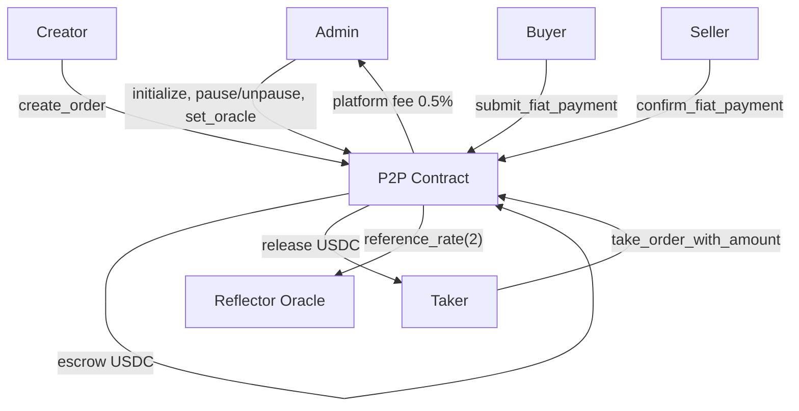

### Contract entrypoints

| Function | Role |
|---|---|
| `initialize(admin, fee_bps, oracle)` | Deploy: set admin, platform fee (50 bps = 0.5%), Reflector oracle address |
| `pause` / `unpause` | Admin-gated circuit breaker |
| `create_order(from_crypto, amount, min_rate)` | Lock USDC in escrow; validates rate against oracle |
| `create_order_cli(...)` | Same but callable from CLI scripts |
| `cancel_order(order_id)` | Creator cancels before taken; returns USDC |
| `take_order(order_id)` | Taker locks in at the current rate |
| `take_order_with_amount(order_id, amount)` | Partial fill; leftover reopens as a new order |
| `submit_fiat_payment(order_id)` | Paying side proves off-chain ARS sent |
| `execute_fiat_transfer_timeout(order_id)` | Auto-refund if counterparty ghosts past timeout |
| `confirm_fiat_payment(order_id)` | Receiving side confirms → USDC released + fee collected |
| `dispute_fiat_payment(order_id)` | Raise a dispute |
| `resolve_dispute(order_id, winner)` | `dispute_resolver` settles on-chain |
| `get_order(order_id)` | Read order state |
| `get_order_count()` | Total orders |
| `get_config()` | Read admin + fee config |
| `set_oracle(oracle_id)` | Admin: update oracle address |
| `get_oracle()` | Read current oracle |
| `reference_rate(asset_code)` | **Cross-contract call** into Reflector → live ARS/USD |

### Deployed contract

| | |
|---|---|
| **Contract ID** | `CAEHRNAPSRSFYGG7BRTZY3XX2XEYSCOJUHIJUYO2FYRJATYUXDFA5JQD` |
| **Network** | Stellar Testnet (`Test SDF Network ; September 2015`) |
| **Oracle** | Reflector SEP-40 `CCSSOHTBL3LEWUCBBEB5NJFC2OKFRC74OWEIJIZLRJBGAAU4VMU5NV4W` |
| **Platform fee** | 50 bps (0.5%) |
| **Seed orders** | 3 live orders (5 USDC @ 1462, 10 USDC @ 1465, 5 USDC @ 1468 ARS/USDC) |
| **Tests** | `cargo test -p p2p` → **20/20 passing** |

---

## 6. Rate oracle

Most P2P ramps quote a rate from a backend the operator controls. PeerlyPay reads it **on-chain**.

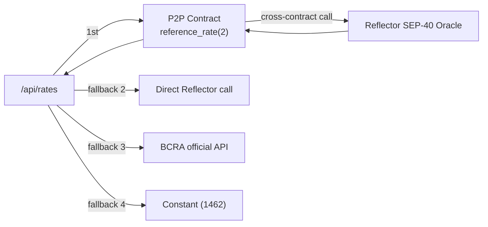

- `reference_rate(2)` passes asset code `2` = ARS to Reflector
- Reflector returns the live ARS/USD price; the contract inverts it to ARS-per-USD
- The frontend always tries the contract first — rate is verifiable on-chain by anyone
- BCRA official rate is shown alongside for transparency (spread visibility)

---

## 7. DeFindex yield vault

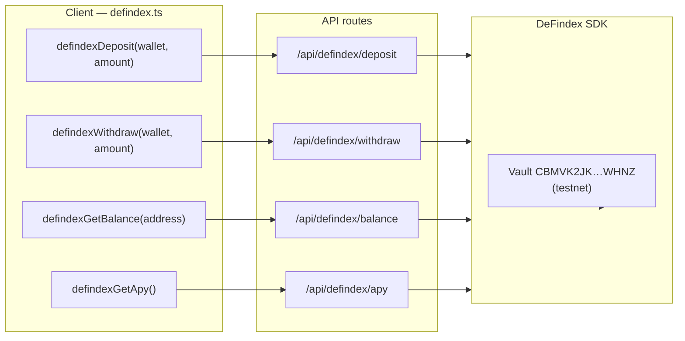

- API routes build the Soroban XDR using the DeFindex SDK
- Client receives the XDR, signs it with Privy, submits to the network
- `VaultBalanceResponse: { dfTokens: number; underlyingBalance: number[] }`
- Live APY: **10.83%** (queried from `sdk.getVaultAPY()`)

---

## 8. Faucet system

New users get 10 USDC on first login so they can trade immediately — no need to find a faucet or fund externally.

| | |
|---|---|
| **Faucet wallet** | `GCHL5GA4JTML4NNRIVXBJ3ER37HEUOCRL4664NPZQCNJ3LAEST6UKBKK` |
| **Amount** | 10 USDC per new user |
| **XLM** | Friendbot called first (for transaction fees) |
| **Guard** | `localStorage` key `peerlypay_faucet_<address>` — never sends twice |
| **Trigger** | Automatically when `stellarAddress` appears in `WalletButton.tsx` |

---

## 9. Security model

Soroban removes some bug classes by design (no `delegatecall`, explicit authorization). What PeerlyPay guards additionally:

- **No fund custody:** USDC moves from creator directly into the contract escrow, never into a PeerlyPay wallet
- **Authorization** on every privileged entrypoint (`require_auth`, admin-gated)
- **Timeout protection:** `execute_fiat_transfer_timeout` prevents funds being stuck indefinitely
- **On-chain arbitration:** `dispute_resolver` address settles disputes — no centralized admin decision
- **Rate integrity:** rate comes from a cross-contract call into an immutable oracle, not an operator-set value
- **Client-side signing:** Privy signs transactions in the browser; private keys never reach the server
- **CORS proxy:** anchor API calls proxied through Next.js routes — anchor JWTs never exposed client-side

---

## 10. Environment variables

| Variable | Scope | Description |
|---|---|---|
| `NEXT_PUBLIC_PRIVY_APP_ID` | Public | Privy app ID — get one at privy.io |
| `NEXT_PUBLIC_P2P_CONTRACT_ID` | Public | P2P escrow contract (testnet) |
| `NEXT_PUBLIC_SOROBAN_RPC_URL` | Public | `https://soroban-testnet.stellar.org` |
| `NEXT_PUBLIC_STELLAR_NETWORK_PASSPHRASE` | Public | `Test SDF Network ; September 2015` |
| `NEXT_PUBLIC_REFLECTOR_FIAT_ORACLE_ID` | Public | Reflector SEP-40 oracle address |
| `DEFINDEX_API_KEY` | Server | DeFindex API key — get one at api.defindex.io/register |
| `FAUCET_SECRET_KEY` | Server | Secret key of the faucet wallet — never expose publicly |

---

## 11. Known limitations (honest disclosure)

| Area | Status |
|---|---|
| **USDC trustline** | `checkUSDCTrustline` returns `true` — not checked on-chain |
| **No backend** | Trade history, profile, reputation live in `localStorage` + Zustand |
| **Demo orders** | When chain has no orders, marketplace shows labeled demo orders |
| **Faucet capacity** | Faucet wallet has a fixed balance — refill from Circle testnet faucet as needed |
| **Mainnet** | Contract + app are testnet-only; Reflector mainnet oracle address is known |

---

## 12. References

- [Stellar Developers](https://developers.stellar.org) — Soroban, RPC, SEPs
- [soroban-sdk](https://crates.io/crates/soroban-sdk) — Rust contract SDK
- [Privy](https://privy.io) — embedded Stellar wallets, email login
- [Reflector Oracle](https://reflector.network) — SEP-40 fiat oracle
- [DeFindex](https://defindex.io) — yield vaults on Stellar
- [SEP-10](https://github.com/stellar/stellar-protocol/blob/master/ecosystem/sep-0010.md) — Web Auth
- [SEP-24](https://github.com/stellar/stellar-protocol/blob/master/ecosystem/sep-0024.md) — Interactive anchor deposit/withdraw
- [Transferencias 3.0](https://www.bcra.gob.ar/MediosPago/Transferencias_3.0.asp) — BCRA instant rail (EMVCo QR)
- [DeFindex SDK docs](https://docs.defindex.io)
- [Stellar Expert testnet](https://stellar.expert/explorer/testnet) — contract explorer
